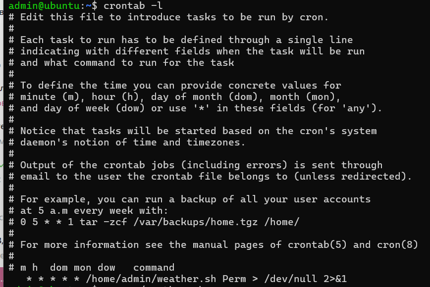
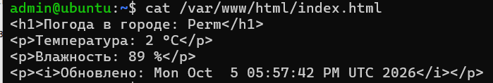
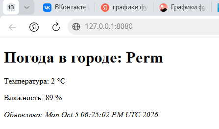

# Лабораторная работа №2: Автоматизация в Linux

## Описание
Выполнена автоматизация сбора данных о погоде с помощью bash-скриптов, утилиты `jq` для парсинга JSON и планировщика `cron`. Результат работы скрипта отображается через веб-сервер Nginx.

## Выполненные задачи
1. Установлены пакеты `nginx` и `jq`.
2. Настроен проброс порта 8080 (хост) → 80 (гостевая VM) в VirtualBox.
3. Написан bash-скрипт `weather.sh`, который:
   - Принимает название города как аргумент.
   - Получает JSON-данные с сервиса `wttr.in`.
   - Парсит температуру и влажность с помощью `jq`.
   - Сохраняет отформатированный HTML в `/var/www/html/index.html`.
4. Настроены права доступа для пользователя `admin` на запись в директорию веб-сервера.
5. Скрипт добавлен в `crontab` для автоматического запуска каждую минуту.

## Исходный код
Основной скрипт автоматизации: [weather.sh](weather.sh)

## Конфигурация планировщика (cron)
Задание для пользователя `admin` (вывод команды `crontab -l`):

    * * * * * /home/admin/weather.sh Perm > /dev/null 2>&1

## Демонстрация результатов

### 1. Проверка задания в cron

*Скрипт запланирован на выполнение каждую минуту.*

### 2. Содержимое генерируемого файла index.html

*Скрипт успешно парсит JSON и записывает валидный HTML.*

### 3. Результат в браузере (хост-машина)

*Веб-сервер Nginx успешно отдает страницу по адресу http://127.0.0.1:8080*
